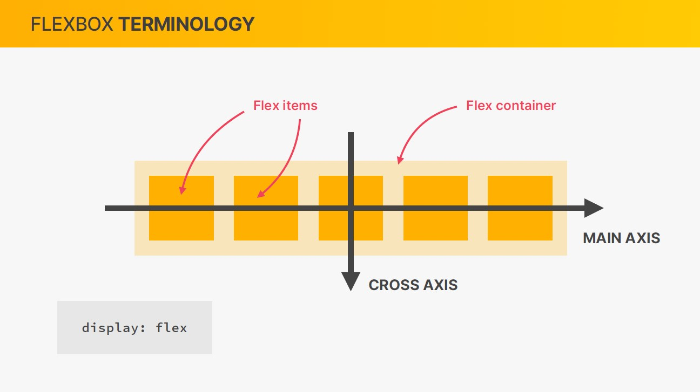
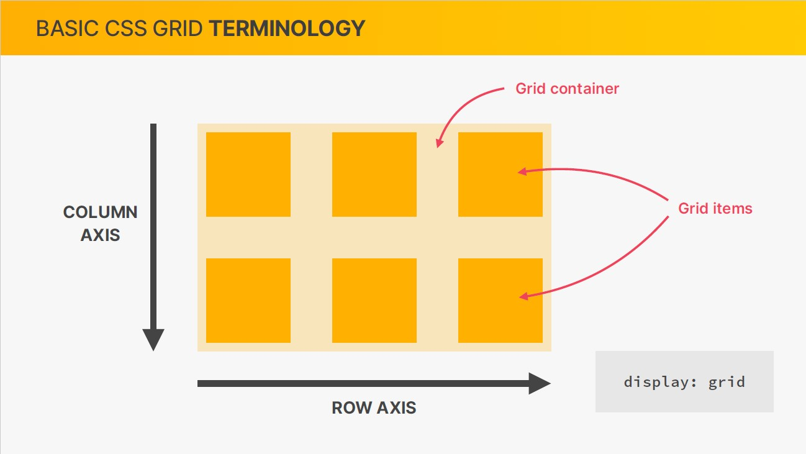
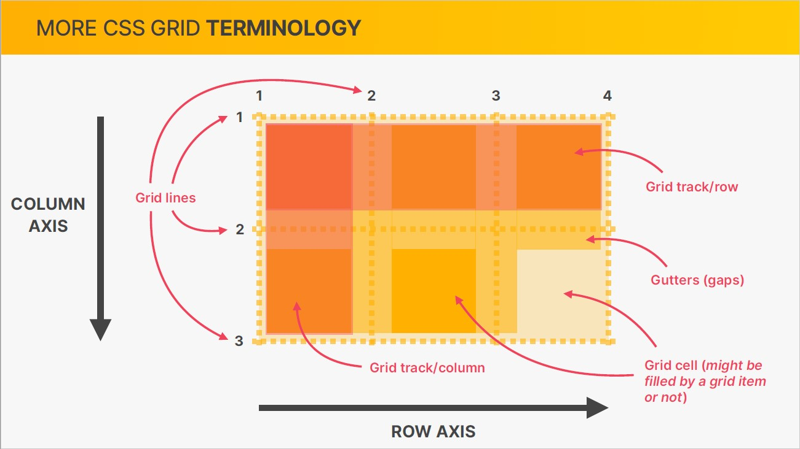
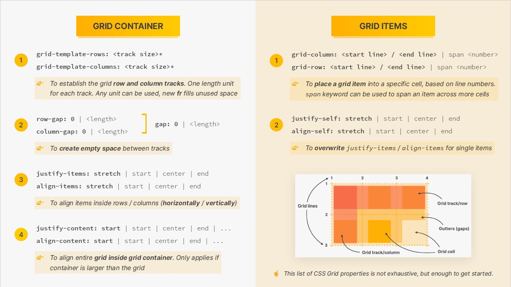

# Shortcut

```
! is shortcut for empty HTML stntax

lorem generates blind text
```

# HTML

```
shortcut for quick classes
.{classname}/.{classname}/.../#{id name}.

use schematic html ie
<strong></strong> not <b></b>

creates a button ot go back one page
<input type="button" value="Go back!" onclick="history.back()" />

<address></address>
special tag for writing addresses

<br></br> line break
<em></em> emphasis
<strong></strong> Bold Text
<sub></sub> Subset
<sup></sup> Superset
```

# CSS elements refernce

```
img basic rotate
https://codepen.io/StrengthandFreedom/pen/BaaQYqw

background-image: url();
[for local items use ("../") or direct link (https://) ]

background-size: auto/contain/cover;
(auto adjust/orginal size/fit to viewport of parent)

box-shadow: 0 0 10px 5px rgba(0, 0, 0, 0.1);
(x, y, spread, thickness, color)

border: 1px solid #0e0e0e;
(border: thickness, type, color)

border-radius: 0px 0px 0px 0px;
(smoothining border: top-left, top-right, bottom-right, bottom-left)
or
border-radius: 0px ; / border-radius: 0px 0px;
(all four corners) / (top-l & bottom-r, top-r & bottom-l)

box-sizing: content-box/border-box
(content-box is default and is not calculated)
(border-box calculates width from border to border)

clear: left/right/both
(clearing the bugs made by clear element)

Clearfix hack - add the class below to collapsing parent class
clearfix::after{clear: both;content:'';display: block;}

cursor: pointer/cess/crossair...;
(select type of cursor on hover)

display: block/inline/inline-block/float/flex/css-grid
(changes beahaviour of the container element)

font-style: italic, unset ,normal ;
(for changing and unsetting font style)

float: left/right (Use with Clearfix)
(makes the element to behave like absolute element in given direction)

padding: 0 0; margin: 0 0:
(top & bottom, left & right)

text-decoration: none/dotted/overline/solid;
(used for links decoration)

text-transform: none, uppercase, lowercase, capitalise;
(for changing the way font looks)
```

# Flexbox

```
display: flex; (To enable flexbox)
```




## Flex-Container -->

```
align-items: center/float-start/flex-end/stretch --- Vertical alignment
(changes flexed elements to center/top/bottom/(default)cover whole parent)

justify-content: center/float-start/flex-end --- Horizantal alignment
(changes flexed elements to center/top/bottom)
justify-content: space-between; ( ooooo ) to ( o o o o o )
(Gives the remaining space between flexed items evenly)

gap : 0; (length)
(create space between items without margin)
```

## Flex-Items -->

```
justify-self: center/flex-start/flex-end/stretch;
align-self: center/flex-start/flex-end/stretch;
(To overwrite justify-items/align items for single items)

flex: 0 1 auto; [Default]
(flex-grow/flex-shrink/flex-basis details below)
<!-- --- -->
flex-shrink:1/0;
(if flex basis overflows the element then flex shrink is controlling it)
(if made 0 it will prevemt basis from shrinking)

flex-grow:1/0/any integer; [ o o    ] ---> [ ( o ) ( o ) ]
(setting it to 1 will grow the child elements to maximum size possible)
(if two elements are set with 1 and 2 then one with 2 will get double of remaining space avaliable to 1)

flex-basis:auto/0px;
(changes the minimum size of child element to given size else stays the same)
<!-- --- -->
```

# CSS Grid -->

```
display:grid; (with) grid-template-colums/rows

```





## Grid Container -->

```

grid-template-colums: width1 width2 (track size). . .; [n widths ,n colums]
(specified width for each coloumb)

grid-template-rows: height1 height2 (track size) . . .; [n heights ,n rows]
(specified height for each row)

[fr element fills unused space]
[fr can be used in specifing dimensions of box in above elements acts like flex grow in responsivescale]


gap/grid-gap: 0; / gap: <row> <colum>;
(gives gap between elements and applies to both rows and colums)
column-gap: 0;/row-gap: 0;
(gives gap between elements in columns and rows respectively)
[Create empty space of guters between tracks]

align-items: stretch(default) /center/start/end --- Vertical alignment
justify-content: stretch(default) /center/start/end --- Horizantal alignment
(To align items inside rows/colums[horizontally/vertically])

justify-content: stretch(default) /center/start/end
align-content: stretch(default) /center/start/end
(To align entire grid indise grid container)
[only applies if container is larger than Grid container]

```

## Grid Cell -->

```
grid-column: <start line> / <end line>
grid-row: <start line> / <end line>
(to place a grid item into a specific cell based on grid line numbers)

justify-self: center/flex-start/flex-end/stretch;
align-self: center/flex-start/flex-end/stretch;
(To overwrite justify-items/align items for single items)

```
